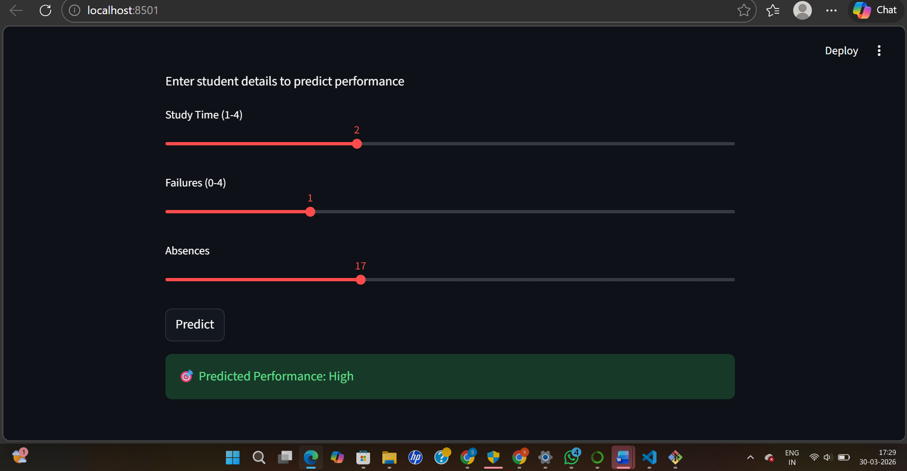
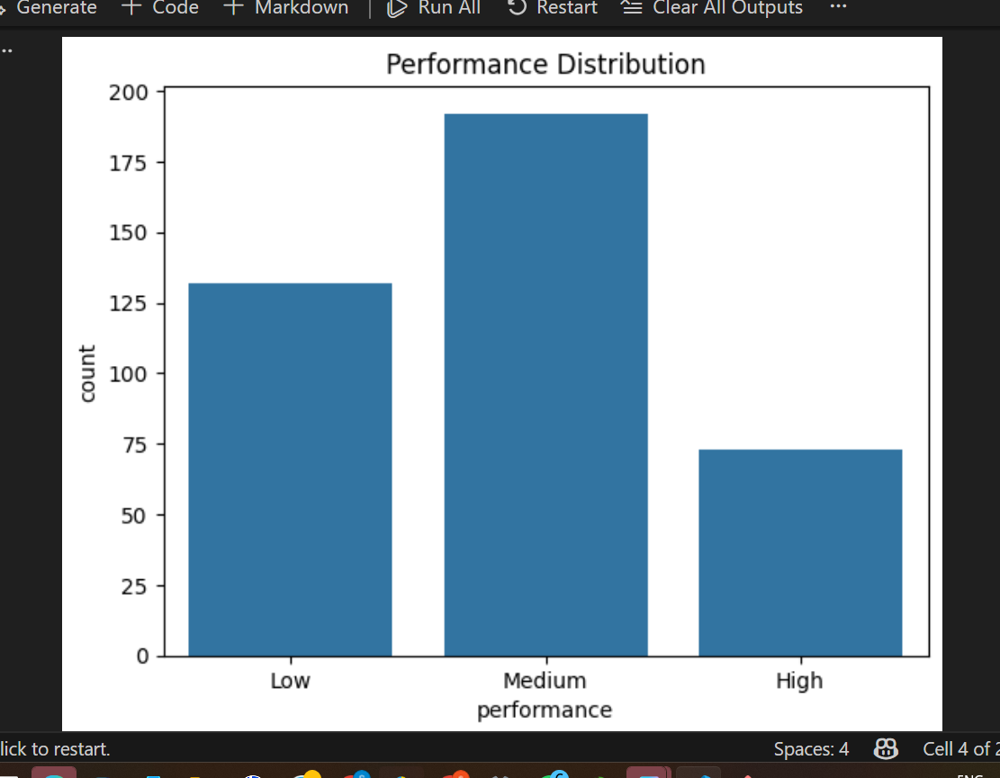

# Student Performance Prediction using Machine Learning

## Project Overview
This project predicts student academic performance using machine learning techniques.  
It classifies students into categories such as **Low, Medium, and High performance** based on academic and behavioral features.

---

## Dataset
The dataset contains student-related attributes such as:
- Study time
- Number of past failures
- Absences
- Demographic and academic details

Target variable:
- Performance (Low / Medium / High)

---

## Technologies Used
- Python
- Pandas
- NumPy
- Scikit-learn
- Matplotlib
- Seaborn
- Streamlit
- Joblib

---

##  Workflow
1. Data Loading and Exploration  
2. Data Preprocessing (Encoding & Scaling)  
3. Feature Selection  
4. Model Training (Random Forest)  
5. Model Evaluation  
6. Model Saving using Joblib  
7. Streamlit App Development  

---

## Model
- Machine Learning Model: **Random Forest Classifier**
- Performance evaluated using accuracy and classification metrics

---

## How to Run the Project

### 1. Clone the repository
```bash
git clone https://github.com/sindhukarnala05-crypto/Student-Performance-Prediction.git
# Project Preview
# Streamlit App


# Prediction Output


# Data Visualization

